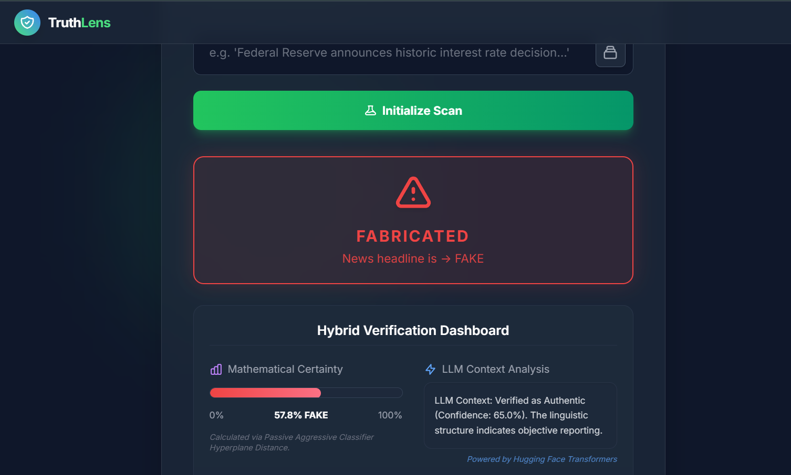
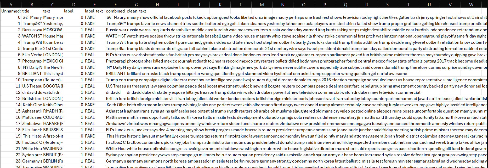

# TruthLens — Fake News Detection System

A Machine Learning + LLM powered web application that detects whether a news headline is **Fake or Real** using NLP and a hybrid verification engine.

---

## Screenshots

### Home Page


### Prediction Engine


### REAL News Result


### FAKE News Result


### Dataset Preview


---

## Key Features

- Real-time fake news detection using a hybrid ML + LLM engine
- **Passive Aggressive Classifier** with TF-IDF vectorization for base prediction
- **DistilBERT zero-shot classification** (Hugging Face Transformers) for context verification
- Mathematical confidence scoring via sigmoid on decision function
- Override logic: LLM can correct ML bias for ambiguous headlines
- Clean dark-themed UI with live confidence progress bar

---

## Tech Stack

| Layer | Technology |
|---|---|
| Language | Python |
| Framework | Flask |
| ML Model | Passive Aggressive Classifier (scikit-learn) |
| NLP | TF-IDF Vectorization |
| LLM | DistilBERT (typeform/distilbert-base-uncased-mnli) |
| Frontend | HTML, Tailwind CSS (Jinja2 Templates) |

---

## How It Works

1. User enters a news headline
2. Text is vectorized using TF-IDF
3. ML model predicts Fake/Real with confidence score
4. DistilBERT LLM performs zero-shot context analysis
5. Override logic reconciles both outputs
6. Final verdict + analysis displayed on dashboard

---

## Installation & Setup

```bash
# Clone the repo
git clone https://github.com/satish-soragaon/fake-news-llm.git
cd fake-news-llm

# Create and activate virtual environment
python -m venv venv
venv\Scripts\activate      # Windows
# source venv/bin/activate  # Mac/Linux

# Install dependencies
pip install -r requirements.txt

# Run the app
python app.py
```

Open in browser: `http://127.0.0.1:5000`

> Note: First startup takes ~15-30 seconds while the LLM model loads.

---

## Dataset

- Labeled dataset with **Fake / Real** news headlines
- Columns: `title`, `text`, `label`, `label_text`, `combined_clean_text`
- Used for training the Passive Aggressive Classifier

---

## Model Details

- **Algorithm:** Passive Aggressive Classifier
- **Feature Extraction:** TF-IDF Vectorizer
- **Accuracy:** 96.4%
- **LLM Layer:** Zero-shot classification via DistilBERT MNLI

---

*Designed & Developed by satish*
